## Introdução

### Justificativa do Projeto
A ocorrência de desastres naturais e emergências humanitárias demanda uma resposta rápida e eficiente, não apenas de profissionais especializados, mas também de voluntários qualificados dispostos a oferecer suas habilidades em prol do bem comum. No entanto, muitas vezes há uma desconexão entre as organizações que necessitam de ajuda e os indivíduos dispostos a voluntariar seu tempo e expertise. Esta plataforma web surge como uma solução para preencher essa lacuna crítica, facilitando a conexão entre organizações e voluntários qualificados, especialmente durante e após situações de crise.

Em momentos de desastre, a velocidade e a eficácia da resposta são cruciais para salvar vidas e minimizar danos. Contudo, a falta de um sistema centralizado e eficiente para coordenar esforços voluntários frequentemente resulta em recursos humanos subutilizados ou mal direcionados. Além disso, muitos profissionais qualificados que desejam ajudar não sabem onde suas habilidades são mais necessárias ou como podem contribuir de forma significativa.

Esta plataforma se justifica pela necessidade urgente de otimizar a alocação de recursos humanos voluntários em situações de emergência, garantindo que as habilidades certas cheguem aos lugares certos no momento certo. Ao facilitar essa conexão, a plataforma não apenas aumenta a eficácia da resposta a desastres, mas também promove um senso de comunidade global e responsabilidade social, permitindo que profissionais utilizem suas habilidades para fazer a diferença quando e onde é mais necessário.

### Objetivos do Projeto
O objetivo principal desta plataforma é criar um ecossistema digital eficiente e responsivo que **conecte organizações em busca de voluntários qualificados com profissionais dispostos a oferecer suas habilidades em situações de desastre e pós-desastre**.

Especificamente, a plataforma visa:
1. Facilitar o encontro entre demanda e oferta de habilidades especializadas em contextos de emergência, permitindo uma resposta mais rápida e eficaz a desastres.
2. Proporcionar um espaço centralizado onde organizações possam publicar "ações" detalhadas, especificando as habilidades necessárias e o nível de prioridade de cada tarefa.
3. Implementar um sistema de priorização de ações, garantindo que as necessidades mais urgentes recebam atenção imediata dos voluntários disponíveis.
4. Melhorar a coordenação e eficiência dos esforços de socorro e recuperação, reduzindo a duplicação de esforços e preenchendo lacunas críticas em habilidades e recursos.
5. Criar um registro de atividades voluntárias, permitindo o reconhecimento do trabalho dos voluntários e facilitando a construção de uma comunidade engajada de profissionais dedicados ao voluntariado qualificado.
6. Promover a transparência e a prestação de contas nos esforços de resposta a desastres, fornecendo uma plataforma clara e acessível para o gerenciamento de projetos voluntários.

## UI/UX
Utilizamos a ferramenta Figma para montar os mockups das telas e a ferramenta Canva para criação da identidade visual do projeto (logo, fontes, paleta de cores), assim podendo desenvolver a aplicação de modo dinâmico e colaborativo.

### Identidade Visual
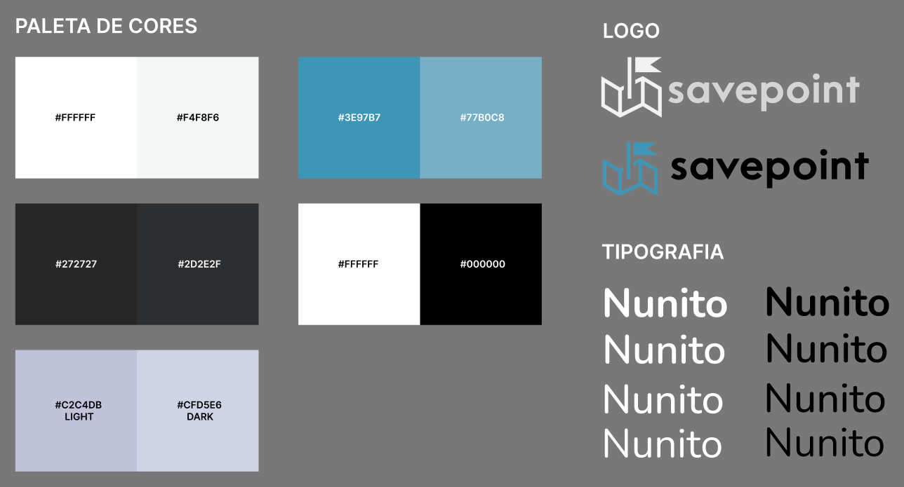

### Mockups

Criamos os fluxos dos usuários a nível de voluntário e de organização. Iniciamos com o fluxo de login, onde o usuário é introduzido ao projeto. 

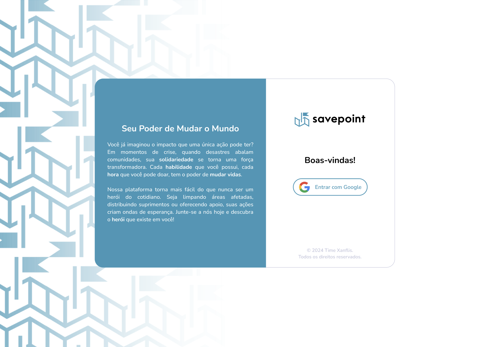

Seleciona seu caminho e preenche suas irnformações.

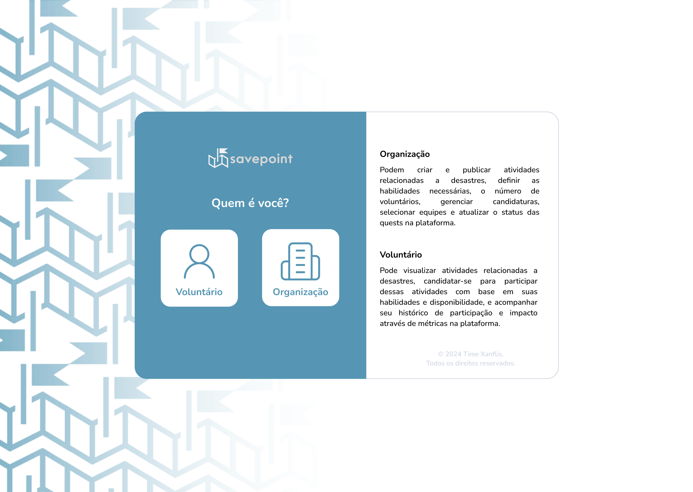
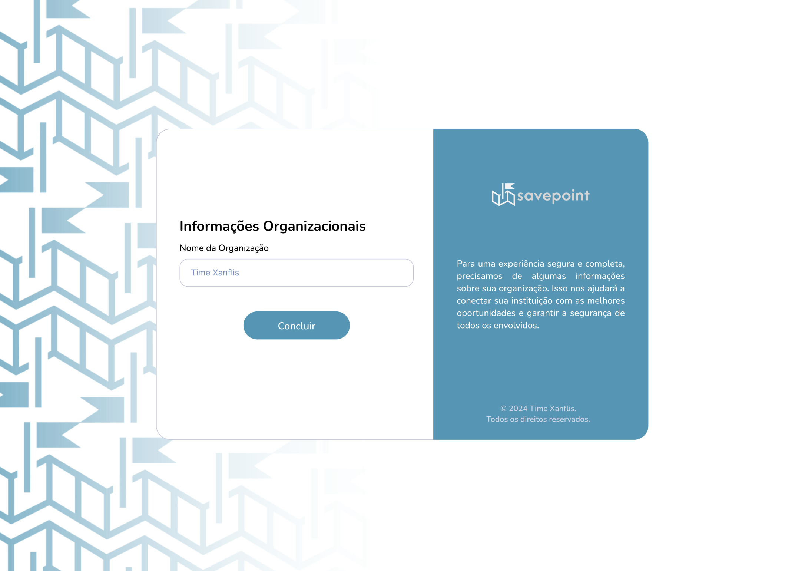

Voluntários selecionam suas expertises para poderem encontrar ações em que pode ajudar.

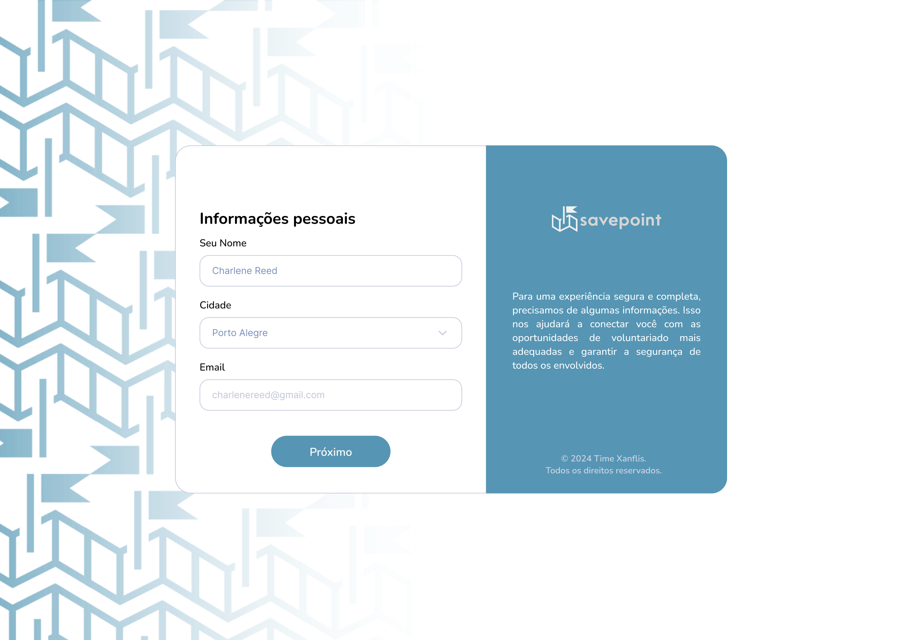
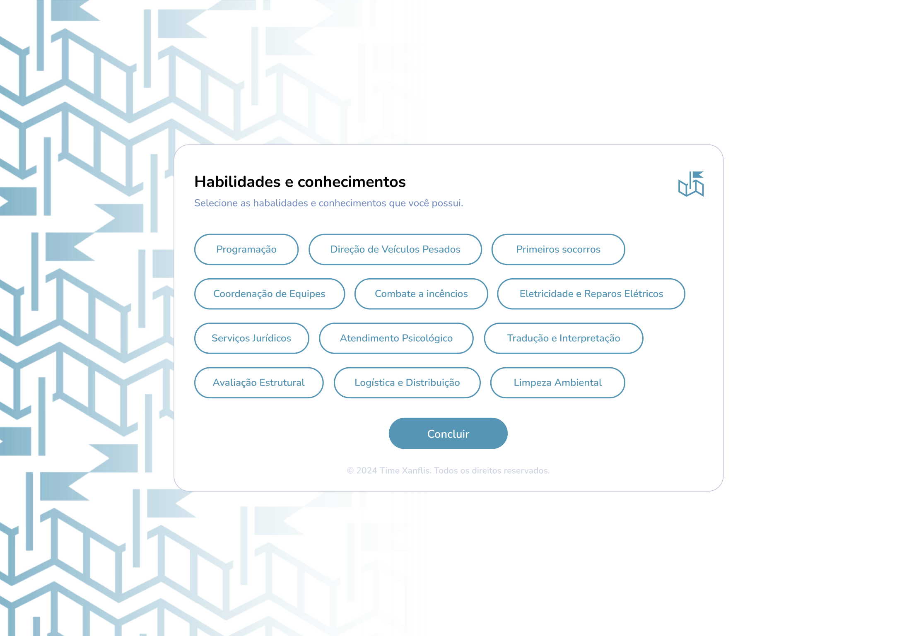

Ao entrar na plataforma, o usuário se depara com ações rankeadas por prioridades em que ele pode se voluntariar a partir também de seus conhecimentos.

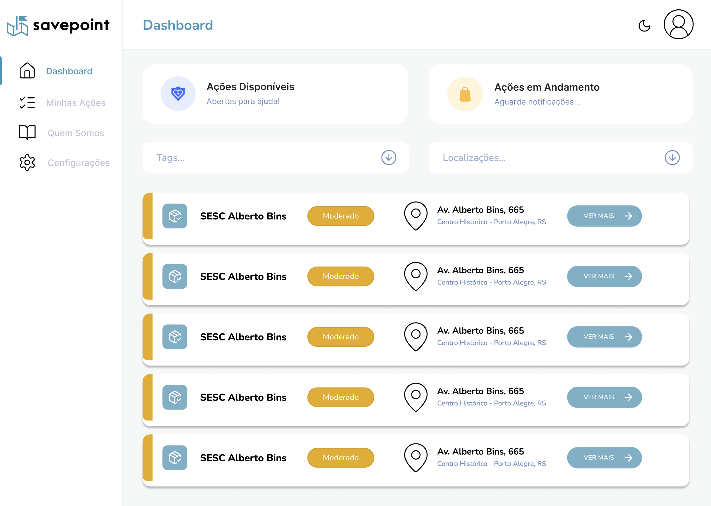

A partir da barra de navegação lateral, o usuário é capaz de acessar as ações que ele, como voluntário, se candidatou, está na espera ou finalizou; e como organização, as que ela criou.

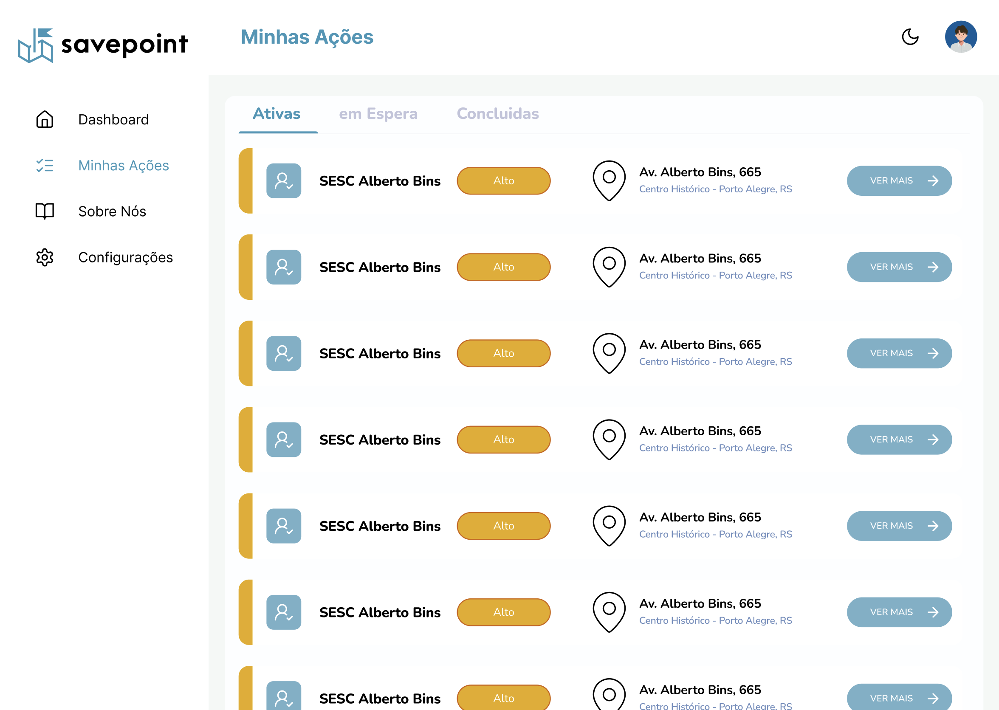

Assim que selecionar a opção "ver mais", o usuário voluntário é redirecionado às informações daquela ação: descrição, localização, nível de prioridade, disponibilidade, necessidades e botão de candidatura.

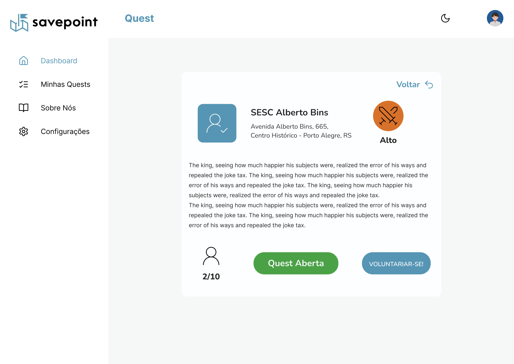

Entrando em sua própria página de perfil, é capaz de observar suas informações pessoais, ver e, se quiser, adicionar outras tags de habilidades.

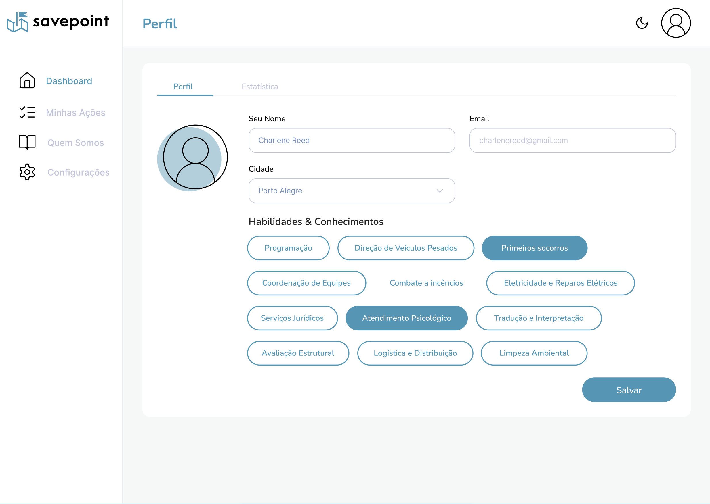

Ao entrar em suas próprias estatísticas, o usuário voluntário se depara com os dados da quantidade de ações envolvidas, concluídas e realizadas naquele ano.

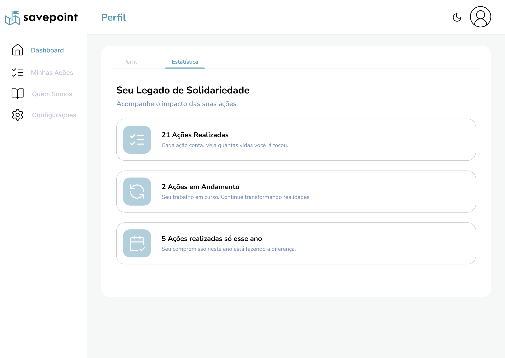

O usuário organização consegue criar uma nova ação, possibilitando descrevê-la, nomeá-la, selecionar sua prioridade, localização, além de suas tags de habilidades necessárias e quantidade de voluntários necessários.

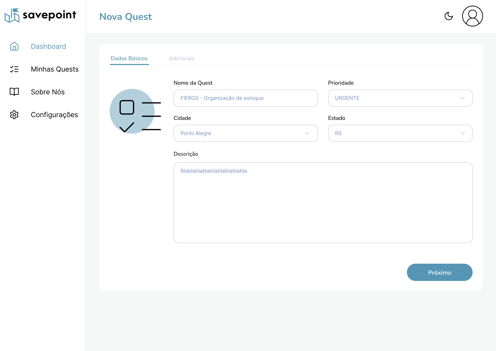
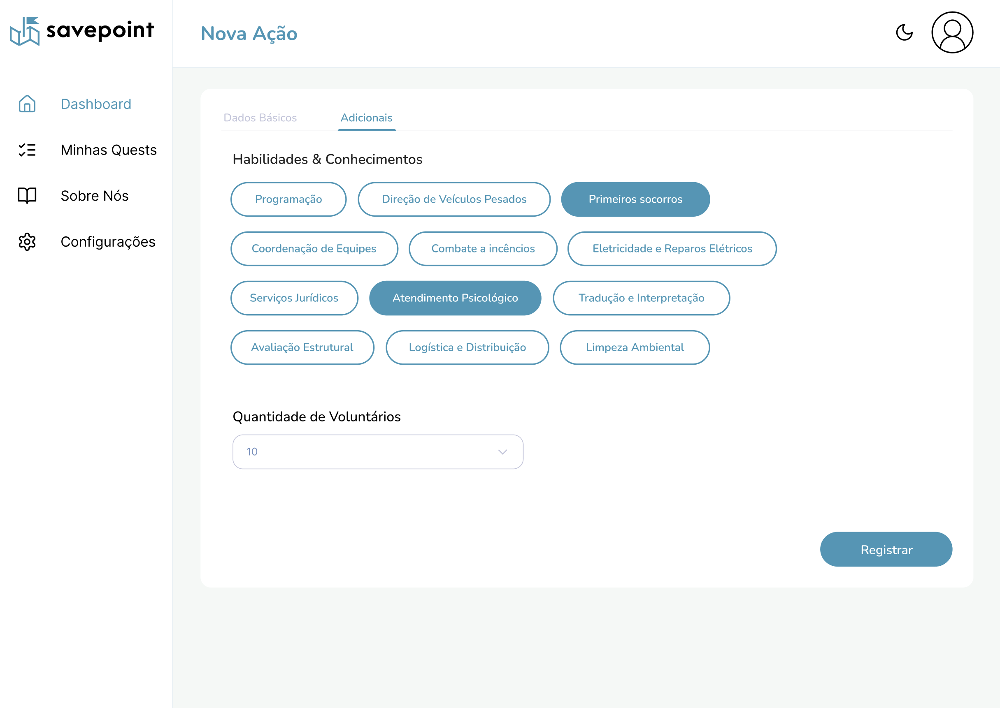

A visão do usuário organização sobre as ações tem apenas a modificação do botão por "Opções", no qual é possível editar suas informações, trocar sua prioridade ou exclui-la.

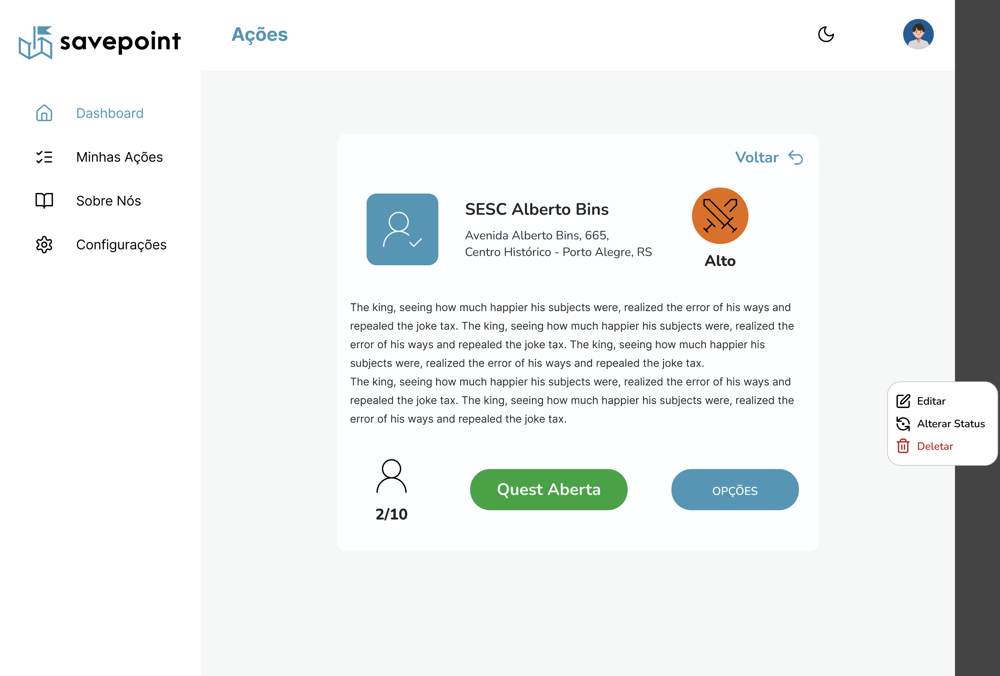

## Tecnologias
Devido às restrições de tempo no desenvolvimento do projeto, optamos por uma abordagem full-stack eficiente, utilizando frameworks e bibliotecas modernas que permitissem um desenvolvimento rápido e robusto. Nossa stack tecnológica inclui:

**Framework Principal - Next.js**

Um framework React de código aberto que oferece renderização híbrida estática e de servidor, geração de sites estáticos, e suporte para TypeScript. Escolhemos o Next.js por sua capacidade de unificar o desenvolvimento frontend e backend em um único repositório, acelerando significativamente nosso processo de desenvolvimento.

**Bibliotecas de UI e Estilização**

**shadcn/ui**: Uma coleção de componentes de UI reutilizáveis e acessíveis, construídos com Radix UI e Tailwind CSS. Esta biblioteca nos permite criar uma interface de usuário consistente e elegante com mínimo esforço de estilização personalizada.

**Lucide**: Uma biblioteca de ícones open-source que oferece um conjunto abrangente de ícones customizáveis, facilitando a implementação de uma interface visual coesa e intuitiva.

**Autenticação e Gerenciamento de Usuários - Clerk**

Uma solução completa de autenticação e gerenciamento de usuários que se integra perfeitamente com Next.js. Clerk nos permite implementar rapidamente funcionalidades de login, registro e gerenciamento de sessões de forma segura e escalável.

**Vantagens da Stack Escolhida**

1. Desenvolvimento Rápido: A combinação de Next.js com bibliotecas pré-configuradas como shadcn/ui e Clerk permite um desenvolvimento ágil e eficiente.
2. Performance Otimizada: Next.js oferece otimizações de performance out-of-the-box, como code splitting e lazy loading.
3. Experiência de Usuário Consistente: shadcn/ui e Lucide garantem uma interface de usuário coesa e profissional com mínimo esforço de desenvolvimento.
4. Segurança Robusta: A utilização do Clerk para autenticação garante que estamos seguindo as melhores práticas de segurança sem necessidade de implementação manual.
5. Escalabilidade: Todas as tecnologias escolhidas são conhecidas por sua capacidade de escalar conforme o crescimento do projeto.

### Banco de Dados e ORM
#### SQLite
Um sistema de gerenciamento de banco de dados relacional leve, rápido e autocontido. Escolhemos SQLite pela sua simplicidade de configuração e por não necessitar de um servidor de banco de dados separado, o que agiliza o desenvolvimento e simplifica a implantação.

#### Drizzle ORM
Um Object-Relational Mapping (ORM) TypeScript-first para SQL, conhecido por sua leveza e desempenho. O Drizzle ORM nos permite interagir com o banco de dados SQLite de forma mais intuitiva e type-safe, aumentando a produtividade do desenvolvimento e reduzindo a probabilidade de erros relacionados a consultas de banco de dados.

**Modelagem Lógica**
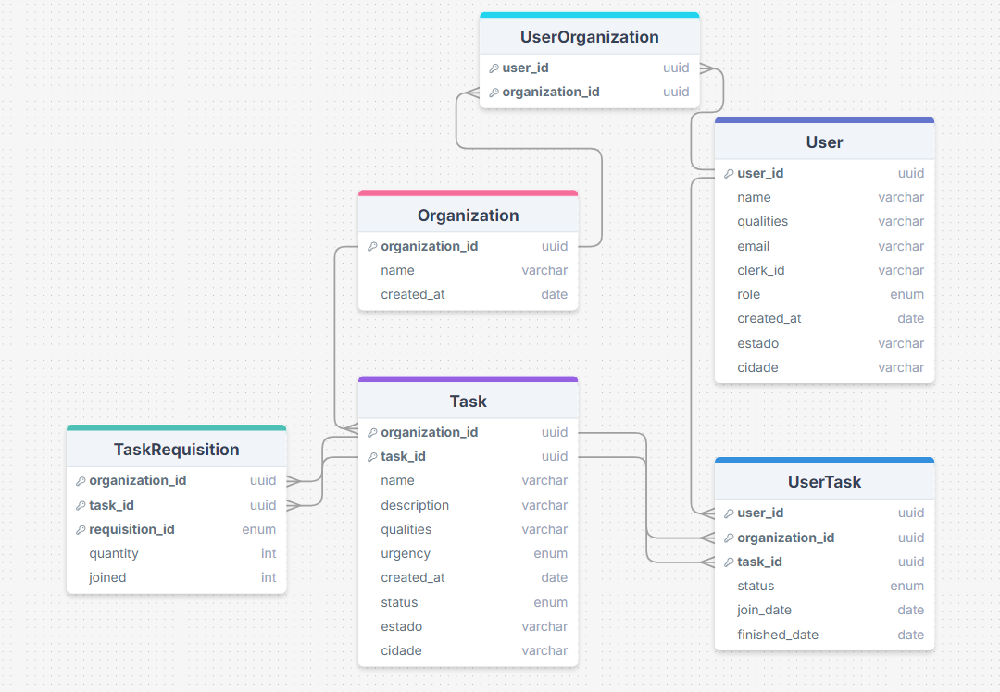

## Processo de Software
Para garantir um desenvolvimento eficiente e organizado de nossa plataforma de voluntariado, adotamos um conjunto de práticas e ferramentas que nos permitem gerenciar tarefas, manter a comunicação da equipe e otimizar o fluxo de trabalho.

### Trello
Utilizamos o Trello como nossa principal ferramenta para controle de atividades e registros. O Trello nos oferece:

1. Visualização Kanban: Organizamos nossas tarefas em colunas como "A Fazer", "Em Progresso", "Em Revisão" e "Concluído", proporcionando uma visão clara do status de cada atividade.
2. Atribuição de Tarefas: Cada card no Trello é atribuído a um ou mais membros da equipe, garantindo clareza sobre as responsabilidades.
3. Priorização: Utilizamos etiquetas e posicionamento de cards para indicar a prioridade das tarefas.
4. Documentação: Os cards do Trello servem como um registro detalhado de cada tarefa, incluindo descrições, comentários e anexos relevantes.

> https://trello.com/b/JxcuOIVK/hackatona

### Reuniões de Milestone
A cada milestone do projeto, realizamos uma breve reunião de status. Estas reuniões têm como objetivos:

1. Alinhamento da Equipe: Compartilhamos o progresso geral do projeto e alinhamos expectativas.
2. Identificação de Bloqueios: Discutimos quaisquer obstáculos ou dificuldades enfrentadas pelos membros da equipe.
3. Colaboração: Oferecemos oportunidades para que membros da equipe solicitem ou ofereçam ajuda em tarefas específicas.
4. Planejamento: Revisamos e ajustamos, se necessário, os próximos passos e prioridades da plataforma.
5. Celebração de Conquistas: Reconhecemos e celebramos os marcos alcançados pela equipe.

### Organização da Equipe
Para otimizar nosso processo de desenvolvimento, adotamos uma abordagem de especialização por áreas. Com isso, a equipe foi dividida em três principais stacks:

- Frontend: Responsável pela implementação da interface do usuário, garantindo uma experiência intuitiva e responsiva.
- Backend: Focada no desenvolvimento da lógica de negócios, APIs e integração com o banco de dados.
- Design: Encarregada de criar e manter a identidade visual do projeto, bem como a experiência do usuário (UX).

Esta divisão nos permite:
1. Especialização: Cada membro pode focar em sua área de expertise, aumentando a qualidade e eficiência do trabalho.
2. Desenvolvimento Paralelo: Diferentes aspectos do projeto podem ser desenvolvidos simultaneamente, acelerando o processo geral.

### Fluxo de trabalho Git
Nosso fluxo de trabalho é baseado em práticas modernas de desenvolvimento de software, com ênfase no controle de versão distribuído usando Git.

#### Estratégia de Branching
Nossa estratégia de branching é projetada para manter a estabilidade do código principal enquanto permite desenvolvimento ativo:

- Branch Principal (main):
Representa o estado atual e estável do projeto.
É uma branch protegida, o que significa que mudanças diretas não são permitidas.
Todas as alterações devem passar por um processo de revisão via Pull Request.

- Branches de Feature:
Criadas a partir da main para desenvolvimento de novas funcionalidades ou correções.
Nomeadas de forma descritiva, por exemplo: feature/add-volunteer-matching ou fix/login-error.

### Práticas de CI/CD
Nosso projeto adota práticas modernas de Integração Contínua (CI) e Entrega Contínua (CD) para garantir um processo de desenvolvimento e implantação eficiente, confiável e escalável. Utilizamos a plataforma Vercel como nossa principal ferramenta de CI/CD e hospedagem.

#### Vercel
A Vercel foi escolhida como nossa plataforma de deploy devido às seguintes vantagens:

1. Integração Perfeita com Next.js: Como criadores do Next.js, a Vercel oferece suporte nativo e otimizado para aplicações Next.js, garantindo o melhor desempenho possível.
2. Deploy Automático: A Vercel se integra diretamente com nosso repositório Git, permitindo deploys automáticos a cada push para a branch principal.
3. Ambientes de Pré-visualização: Para cada pull request, a Vercel cria automaticamente um ambiente de pré-visualização, facilitando a revisão e teste de alterações antes do merge.
4. Escalabilidade: A infraestrutura serverless da Vercel permite que nossa aplicação escale automaticamente conforme a demanda, sem necessidade de configuração manual.
